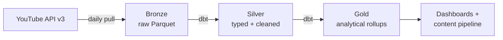

# YouTube Data Pipeline

> End-to-end analytics pipeline tracking YouTube competitor channels across four content niches — built to showcase modern data-engineering patterns (medallion, Hive partitioning, quota-aware ingestion, containerisation).


## What it does

Daily snapshots of the last *N* videos for ~12 channels via the **YouTube Data API v3**. Data lands in a Hive-style partitioned Parquet layout (`date=YYYY-MM-DD/channel_id=UCxxxx/`) ready for downstream medallion modelling. Every run is **quota-aware** (10 000 unit/day budget) with soft-warn at 80 % and hard-stop at 95 %, recorded as an append-only JSONL ledger.

## Architecture



## Quickstart

```bash
# 1. Clone and configure
git clone https://github.com/lackbear/youtube-content-analysis.git
cd youtube-content-analysis
cp .env.example .env
# edit .env and paste your YOUTUBE_API_KEY
# get one at: https://console.cloud.google.com/apis/credentials

# 2. Build + run a tiny safe test (~4 API units)
docker compose build --pull
docker compose run --rm collector --channels SiimLand --max-videos 3

# 3. Inspect output
ls data/raw/video_stats/date=*/channel_id=*/
```

## Tech stack

| Layer | Tool |
|---|---|
| Ingestion | Python 3.10 · `google-api-python-client` · `pandas` · `pyarrow` |
| Storage | Parquet *(bronze)* · PostgreSQL *(chapter 4)* · Databricks CE *(phase 2)* |
| Orchestration | Airflow *(chapter 4)* |
| Transformation | dbt + DuckDB *(chapter 4)* |
| Packaging | Docker multi-stage · docker-compose |

## Roadmap

| # | Chapter | Status |
|---|---|---|
| 1 | Collector v1 — working daily snapshot | ✅ shipped |
| 2 | Collector v2 — quota tracking, sub-partitioning, ingestion timestamps | ✅ shipped |
| 3 | Containerisation — Docker multi-stage + compose | ✅ shipped |
| 4 | Orchestration — Airflow + PostgreSQL + dbt | 🚧 next |
| 5 | Databricks + medallion (Silver / Gold) | ⏳ planned |
| 6 | Content generation — short-form auto-publishing | ⏳ planned |

## Repo layout

```
├── Collectorv2.py       # active collector (chapter 2)
├── config.yaml          # all behaviour-driving knobs
├── Dockerfile           # multi-stage, non-root, slim-bookworm
├── docker-compose.yml   # one service today, three after chapter 4
├── Makefile             # docker compose shortcuts (optional)
├── data/                # bronze Parquet (gitignored)
├── logs/                # event + quota JSONL (gitignored)
└── docs/
    └── ARCHITECTURE.md  # 700-line deep dive — start here for the why
```

## Deep dive

Full design rationale, chapter-by-chapter narrative, and target architecture live in [**docs/ARCHITECTURE.md**](docs/ARCHITECTURE.md).

---

*Built as a working pipeline **and** a learning log — every chapter is a standalone file (`Collector.py`, `Collectorv2.py`, …) so the diff tells the story.*
