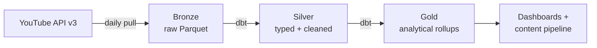

# YouTube Data Pipeline

> End-to-end analytics pipeline tracking YouTube competitor channels across two content niches (AI & Automation, Health & Longevity) — built to showcase modern data-engineering patterns: medallion architecture, Hive partitioning, quota-aware ingestion, containerised orchestration, dbt+DuckDB transformation, live Streamlit dashboard, and a curator loop that detects stale channels and queues AI-sourced replacements.


## What it does

Daily snapshots of the latest *N* videos per channel via the **YouTube Data API v3**, partitioned Hive-style (`date=YYYY-MM-DD/channel_id=UCxxxx/`) into Parquet. From there:

1. **Airflow** schedules and orchestrates the pipeline (two parallel DAG variants — one PythonOperator, one BashOperator — to demonstrate operator trade-offs side-by-side).
2. **dbt + DuckDB** reads the parquet directly and builds silver (`stg_video_stats`, `dim_channel`) + gold (`fct_video_growth_7d`) tables.
3. A **Streamlit dashboard** reads the warehouse read-only and renders pipeline freshness, growth signals, and the channel-overlap heatmap that explains the bronze "latest-N" limitation.
4. A **curator loop** (`detect_stale.py` + `discover.py`) flags inactive channels and queues AI-sourced replacements via a `candidates.csv` review flow.

Every API run is **quota-aware** — soft-warn at 80%, hard-stop at 95% of the 10 000-unit daily budget, recorded as an append-only JSONL ledger.

## Architecture



## Quickstart

```bash
# 1. Clone and configure
git clone https://github.com/lackbear/youtube-content-analysis.git
cd youtube-content-analysis
cp .env.example .env
# edit .env and paste your YOUTUBE_API_KEY
# get one at: https://console.cloud.google.com/apis/credentials

# 2. Build + run a tiny safe test (~4 API units)
docker compose build --pull
docker compose run --rm collector --channels SiimLand --max-videos 3

# 3. Inspect output
ls data/raw/video_stats/date=*/channel_id=*/
```

## Tech stack

| Layer | Tool | Chapter |
|---|---|---|
| Ingestion | Python 3.10 · `google-api-python-client` · `pandas` · `pyarrow` | 1, 2 |
| Packaging | Docker multi-stage · docker-compose | 3 |
| Orchestration | Airflow (LocalExecutor) + PostgreSQL (Airflow metadata) | 4 |
| Transformation | dbt-core + dbt-duckdb (parquet-native, swappable to dbt-databricks in phase 2) | 5 |
| Visualization | Streamlit (read-only over the local DuckDB) | 5.5 |
| Curator | DuckDB-based stale detection + AI-driven discovery + queue review | 6 |
| Future / Phase 2 | dbt-databricks adapter (one-line swap; models migrate verbatim) | — |

## Three local services

| Service | URL | What it shows |
|---|---|---|
| Airflow | http://localhost:8080 | Three DAGs: `youtube_pipeline_python`, `youtube_pipeline_bash`, `youtube_curator` |
| dbt docs | http://localhost:8081 | Lineage graph, model SQL, sources |
| Dashboard | http://localhost:8501 | Live pipeline state, channel registry, growth signals, curator queue |

## Roadmap

> **Composable by design.** Each chapter is a self-contained block over an idempotent contract with the chapter below it. You can stop anywhere and still have a working system — just `python ingestion/Collectorv2.py` produces bronze parquet on disk; chapter 4 schedules that same script; chapter 5 reads the same parquet through dbt; phase 2 swaps DuckDB for Databricks without touching the models. **Run any subset, replay any block — every layer is idempotent over its inputs.**

| # | Chapter | Status |
|---|---|---|
| 1 | Collector v1 — working daily snapshot | ✅ shipped |
| 2 | Collector v2 — quota tracking, sub-partitioning, ingestion timestamps | ✅ shipped |
| 3 | Containerisation — Docker multi-stage + compose | ✅ shipped |
| 4 | Orchestration — Airflow + PostgreSQL | ✅ shipped |
| 5 | Transformation — dbt + DuckDB (Silver / Gold) | ✅ shipped |
| 5.5 | Live-state Streamlit dashboard | ✅ shipped |
| 6 | Dynamic competitor management (CSV registry, stale detection, AI-curated discovery) | ✅ shipped |

**Future / swappable blocks** *(not numbered — they replace pieces above without changing the contract)*

| Phase | Scope | Status |
|---|---|---|
| 2 | Cloud lakehouse — re-platform medallion onto Databricks Community Edition (dbt models migrate verbatim) | ⏳ stretch |

## Repo layout

Each block lives in its own folder with its own `requirements.txt` so it can be installed and run independently.

```
├── ingestion/                       # Block 1 — collector
│   ├── Collectorv2.py               # active collector (chapter 2, v2.1 in 4)
│   ├── Collector.py                 # chapter 1 — kept for the diff narrative
│   └── requirements.txt
├── dags/                            # Block 2 — Airflow (chapter 4 + 5 + 6)
│   ├── python_operator/             # PythonOperator dbt variant
│   │   └── youtube_pipeline.py      # dag_id: youtube_pipeline_python
│   ├── bash_operator/               # BashOperator dbt variant (sibling DAG)
│   │   └── youtube_pipeline.py      # dag_id: youtube_pipeline_bash
│   └── curator/                     # weekly curator (chapter 6)
│       └── airflow_dag_curator.py   # dag_id: youtube_curator
├── dbt_youtube/                     # Block 3 — dbt project (chapter 5)
│   ├── dbt_project.yml
│   ├── profiles.yml                 # project-local DuckDB at ../data/warehouse/dev.duckdb
│   ├── models/
│   │   ├── bronze/sources.yml       # parquet + competitors.csv via meta.external_location
│   │   ├── silver/
│   │   │   ├── stg_video_stats.sql
│   │   │   └── dim_channel.sql      # chapter 6 — sourced from competitors.csv
│   │   └── gold/
│   │       └── fct_video_growth_7d.sql  # ASOF JOIN over snapshot history
│   └── requirements.txt
├── dashboard/                       # Block 4 — Streamlit (chapter 5.5)
│   ├── app.py
│   ├── README.md
│   ├── screenshots/overview.png
│   └── requirements.txt
├── scripts/                         # Block 5 — curator + utilities (chapter 6)
│   ├── detect_stale.py              # flags channels with no posts in N days
│   ├── discover.py                  # validates AI-sourced candidates → candidates.csv
│   ├── API_test.py                  # one-off: sanity-ping the YouTube key
│   └── get_channel_id.py            # one-off: resolve a handle to channel_id
├── config.yaml                      # behaviour knobs (refresh_days, cache_max_age, quota, …)
├── competitors.csv                  # channel registry (chapter 6: handle, channel_id,
│                                    # name, niche, tier, active, …)
├── Dockerfile                       # multi-stage, non-root, slim-bookworm
├── docker-compose.yml               # collector + Postgres + Airflow scheduler/webserver
├── Makefile                         # docker compose shortcuts
├── data/                            # gitignored
│   ├── raw/video_stats/             # bronze parquet (collector output)
│   ├── warehouse/dev.duckdb         # DuckDB warehouse (dbt output)
│   └── curator/                     # stale_channels.csv, candidates.csv, candidates_input.csv
├── logs/                            # gitignored — event + quota JSONL + Airflow task logs
└── docs/
    ├── ARCHITECTURE.md              # full narrative, chapter-by-chapter
    ├── COLLECTORV2.md               # collector user guide
    ├── MAKE.md                      # make shortcuts
    └── prompts/                     # AI prompts used in the project
        ├── source-200-channels.md   # the prompt for chapter 6 channel sourcing
        └── candidates_input.example.csv
```

## Deep dive

- [**docs/COLLECTORV2.md**](docs/COLLECTORV2.md) — user guide for the collector: setup, all attributes, CLI recipes, output layout
- [**docs/ARCHITECTURE.md**](docs/ARCHITECTURE.md) — full design rationale, chapter-by-chapter narrative, target architecture

---

*Built as a working pipeline **and** a learning log — every chapter is a standalone file (`Collector.py`, `Collectorv2.py`, …) so the diff tells the story.*
