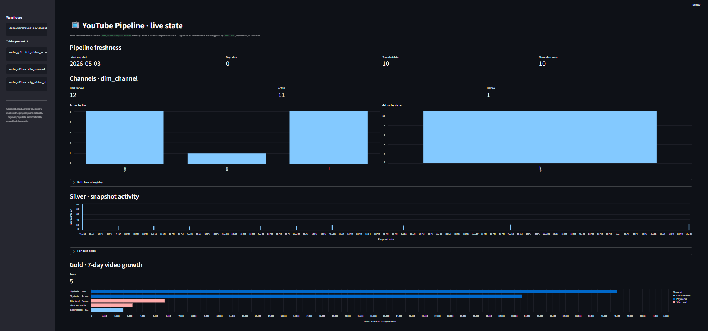

# Dashboard

Live-state Streamlit app over the local DuckDB warehouse at `data/warehouse/dev.duckdb`.



## Run

```bash
venv/Scripts/python -m pip install -r dashboard/requirements.txt
venv/Scripts/streamlit run dashboard/app.py
```

Open <http://localhost:8501>.

## What's on screen

- **Pipeline freshness** — latest snapshot, days since, snapshot dates, channels covered.
- **Channels · dim_channel** — totals + active/inactive, by-tier and by-niche bars, full registry expander.
- **Silver — snapshot activity** — rows captured per snapshot date.
- **Gold — 7-day video growth** — top videos by views added in a rolling 7-day window.
- **Why gold is small** — overlap heatmap of `video_id`s shared between every pair of snapshot dates.
- **What's next** — coming-soon cards that flip to ✓ as new dbt models land.

## Ports

| Service | URL |
|---|---|
| Airflow | http://localhost:8080 |
| dbt docs | http://localhost:8081 |
| Dashboard | http://localhost:8501 |

## Troubleshooting

- **No warehouse found** → `cd dbt_youtube && DBT_PROFILES_DIR=. dbt run` first.
- **Port 8501 in use** → `streamlit run dashboard/app.py --server.port 8502`.
- **Empty silver / gold** → trigger the collect task in Airflow, then re-run dbt.
